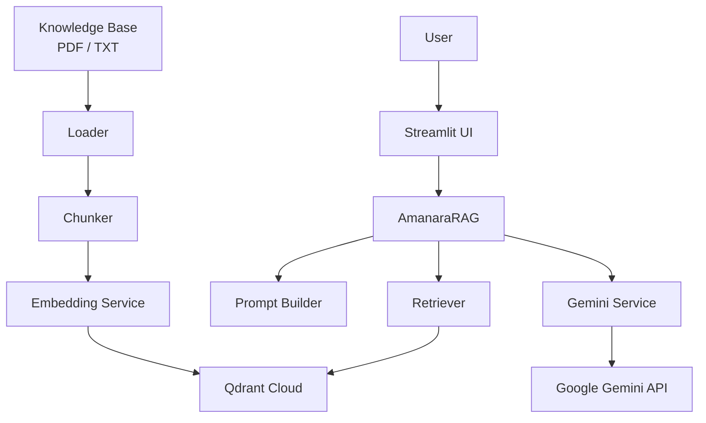

# Amanara AI RAG Chatbot

## Overview

Amanara AI is a Retrieval-Augmented Generation (RAG) chatbot developed to provide accurate, context-aware responses using a private knowledge base. The application combines Google Gemini, Qdrant Cloud, and a Streamlit interface to answer user queries based exclusively on uploaded documents.

Unlike a general-purpose AI assistant, Amanara AI retrieves relevant information from its knowledge base before generating a response, reducing hallucinations and improving answer reliability.

This project demonstrates the implementation of a production-style RAG pipeline, including document ingestion, semantic search, prompt engineering, vector storage, and conversational interaction.

## Features

- Retrieval-Augmented Generation (RAG) pipeline
- Google Gemini for response generation
- Google Gemini Embeddings for semantic search
- Qdrant Cloud as the vector database
- PDF and TXT document ingestion
- Automatic document chunking
- Semantic similarity search
- Streamlit-based conversational interface
- Conversation history
- Source document citations for responses
- Knowledge base upload and rebuild from the UI
- Environment-based configuration using `.env`

## System Architecture


## Project Structure

```text
amanara-chatbot/
│
├── knowledge_base/              # PDF and TXT documents
├── scripts/                     # Utility and ingestion scripts
│
├── src/
│   └── amanara/
│       ├── api/
│       ├── calculators/
│       ├── config/
│       ├── core/
│       ├── memory/
│       ├── models/
│       ├── prompts/
│       ├── rag/
│       ├── services/
│       └── ui/
│
├── .env.example
├── .gitignore
├── pyproject.toml
└── README.md
```